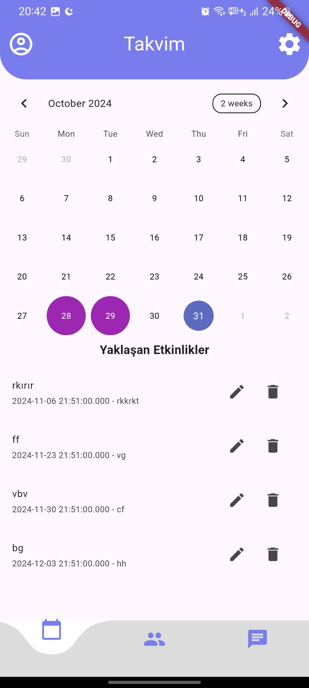
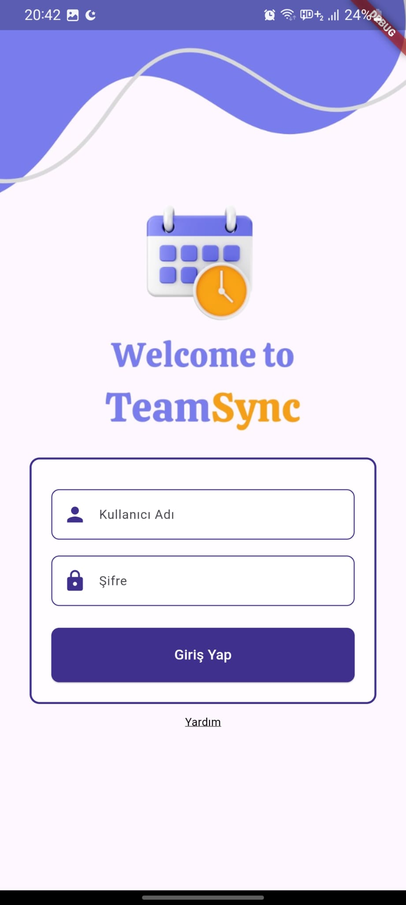
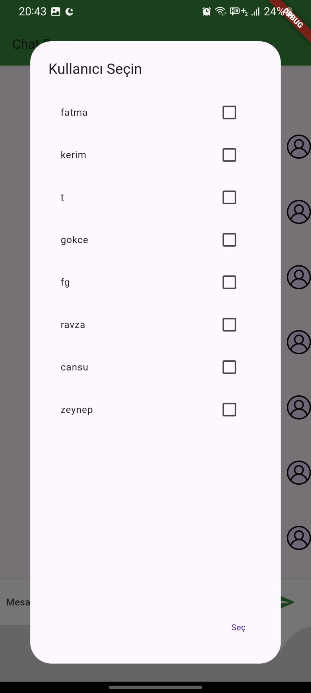
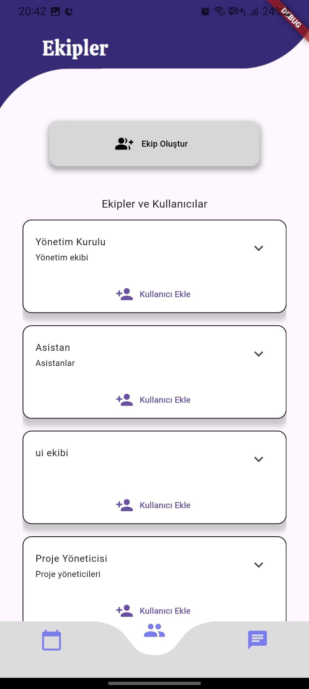
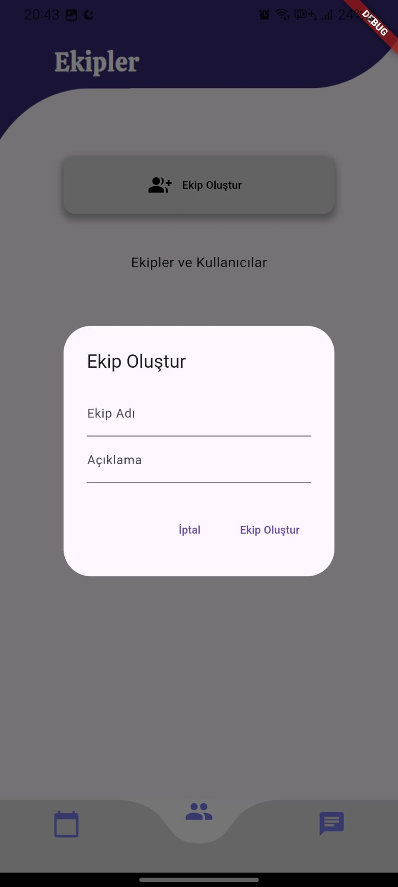

# TeamSync

## 📖 Overview

TeamSync is a comprehensive team management application developed using **Flutter**. The app utilizes Firebase Firestore and Firebase Cloud Messaging integrations to provide real-time collaboration and notification capabilities. Users can manage events, send notifications, and communicate effectively through a built-in chat feature.

---

---

## 🚀 Features

- **Authentication**: Automatically redirects users to the homepage if they have previously logged in.
- **Role-Based Access Control**: Different permissions based on user roles.
- **Real-Time Messaging**: A chat feature that allows team members to communicate seamlessly.
- **Event Management**:
  - Add and edit events using the Table Calendar package.
  - Notifications are sent to users when a new event is added.
  - Displays official holidays in Turkey using the Google Calendar API.
- **Notification System**:
  - Retrieves users' device token information to send notifications.
  - Sends individual or team notifications based on selection.
- **Team and User Management**:
  - Assign events and messages to specific teams or users.
  - Dynamically fetch team and user data from Firestore.

---

## 👋 Usage

- **User Login**:
  - **New Users**: Sign up using your email and password.
  - **Returning Users**: Automatically redirected to the homepage if already logged in.

- **Event Management**: Add, edit, and view events on the calendar. Send notifications to users about new or updated events. View official holidays in Turkey using the Google Calendar API.

- **Messaging**: Use the chat feature to send messages to individuals or teams. Filter messages based on roles or teams.

- **Notifications**: Notifications are sent to users via Firebase Cloud Messaging. Supports sending notifications to specific teams or individual users.

---

## 📦 Dependencies

- **Core Dependencies**:
  - Firebase Core: `firebase_core: ^3.3.0`
  - Firebase Messaging: `firebase_messaging: ^15.1.0`
  - Cloud Firestore: `cloud_firestore: ^5.4.0`
  - Firebase Analytics: `firebase_analytics: ^11.3.0`
  - Flutter Local Notifications: `flutter_local_notifications: ^17.2.2`

- **UI and Navigation**:
  - Table Calendar: `table_calendar: ^3.1.2`
  - Curved Navigation Bar: `curved_navigation_bar: ^1.0.6`
  - Cupertino Icons: `cupertino_icons: ^1.0.8`

- **Utilities**:
  - Shared Preferences: `shared_preferences: ^2.3.2`
  - Crypto: `crypto: ^3.0.5`
  - HTTP: `http: ^1.2.2`
  - Google APIs Auth: `googleapis_auth: ^1.6.0`
  - Flutter Launcher Icons: `flutter_launcher_icons: ^0.14.1`

---

## 🗃️ File Structure

- **ManagementTeamChatPage**: Manages team-based messaging.
- **Firebase API Integration**: Handles interactions with Firestore and FCM.
- **Message Model**: Defines the structure of messages sent and received.
- **Google Calendar Integration**: Fetches official holidays in Turkey.
- **Shared Preferences**: Used for saving and retrieving user session data locally.

## 📸 Images

Here are some screenshots of the TeamSync application:

